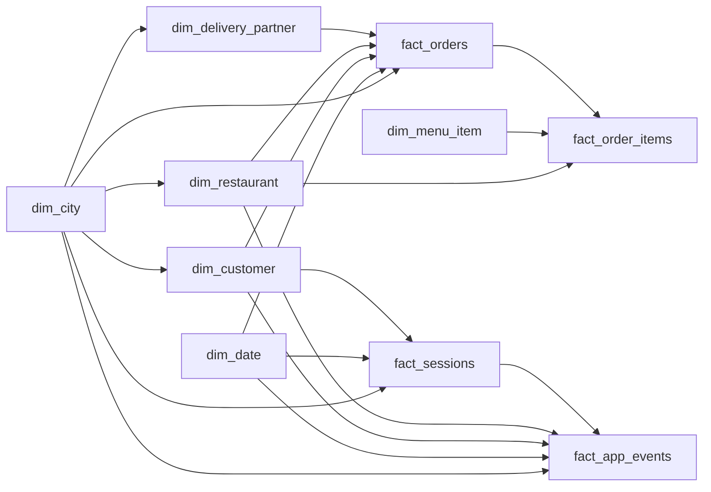

# Food Delivery Product Analytics Warehouse

A PostgreSQL analytics project for a Zomato-style food delivery marketplace. The project creates a relational warehouse from synthetic marketplace data and provides SQL analyses for customer behaviour, retention, acquisition, delivery operations, funnel conversion, products, and restaurants.

The repository contains both the generated CSV snapshot and the SQL required to recreate the warehouse locally. It is designed as a portfolio project for demonstrating product analytics, SQL data modelling, metric definition, and operational analysis.

## Project Scope

The analysis covers the full customer journey:

1. Customer acquisition and customer personas
2. App sessions and conversion funnel drop-off
3. Restaurant and menu discovery
4. Cart, checkout, and order placement
5. Delivery speed, SLA performance, and partner operations
6. Order economics, discounts, commission income, and contribution margin
7. Repeat purchase, cohorts, retention, churn, and resurrection
8. Product mix, basket affinity, payment methods, and vegetarian penetration
9. Restaurant concentration, cuisine performance, cancellations, and leaderboards

## Architecture

The warehouse follows a star-schema design. Dimension tables describe the marketplace entities, while fact tables store orders, order lines, sessions, and app events.



## Repository Structure

| Path | Purpose |
| --- | --- |
| [`01_data_csv/dim_tables`](01_data_csv/dim_tables) | Dimension CSV files |
| [`01_data_csv/fact_tables`](01_data_csv/fact_tables) | Fact CSV files |
| [`02_database`](02_database) | PostgreSQL schema, tables, constraints, indexes, and loading scripts |
| [`03_analysis`](03_analysis) | Product and operational analysis queries |
| [`04_dasboard`](04_dasboard) | Reserved for dashboard exports or BI assets; currently empty |
| [`script/db_generator.py`](script/db_generator.py) | Reproducible synthetic data generator |
| [`requirement.txt`](requirement.txt) | Dependency file; currently empty |

## Data Snapshot

The checked-in CSV files contain the default generated dataset. Counts below exclude the CSV header row.

| Table | Type | Rows | Grain |
| --- | --- | ---: | --- |
| `dim_city` | Dimension | 50 | One row per city |
| `dim_date` | Dimension | 1,461 | One row per calendar date, 2023-01-01 to 2026-12-31 |
| `dim_customer` | Dimension | 12,000 | One row per customer |
| `dim_restaurant` | Dimension | 1,500 | One row per restaurant |
| `dim_delivery_partner` | Dimension | 2,500 | One row per delivery partner |
| `dim_menu_item` | Dimension | 15,547 | One row per restaurant menu item |
| `fact_orders` | Fact | 150,000 | One row per order |
| `fact_order_items` | Fact | 330,270 | One row per order line item |
| `fact_sessions` | Fact | 273,257 | One row per app session |
| `fact_app_events` | Fact | 730,651 | One row per sampled app event |

The generator is seeded with `42`, uses an as-of date of `2026-06-30`, and creates dates through `2026-12-31` for calendar analysis. The event stream is sampled, while `fact_sessions` contains the complete session-level funnel.

## Data Model

### Dimensions

- [`dim_city.csv`](01_data_csv/dim_tables/dim_city.csv): city, state, tier, region, timezone, and metro flag.
- [`dim_date.csv`](01_data_csv/dim_tables/dim_date.csv): date, week, month, quarter, year, weekday, and weekend flag.
- [`dim_customer.csv`](01_data_csv/dim_tables/dim_customer.csv): signup profile, persona, Gold membership, device preference, city, and marketing channel.
- [`dim_restaurant.csv`](01_data_csv/dim_tables/dim_restaurant.csv): cuisine, city, price tier, rating, commission rate, preparation time, and vegetarian status.
- [`dim_delivery_partner.csv`](01_data_csv/dim_tables/dim_delivery_partner.csv): partner, city, vehicle type, joining date, and rating.
- [`dim_menu_item.csv`](01_data_csv/dim_tables/dim_menu_item.csv): menu item, restaurant, category, price, and vegetarian flag.

### Facts

- [`fact_orders.csv`](01_data_csv/fact_tables/fact_orders.csv): order timestamps, fees, discounts, GOV, NOV, commission income, contribution margin, delivery performance, status, payment method, and rating.
- [`fact_order_items.csv`](01_data_csv/fact_tables/fact_order_items.csv): item-level quantities, unit prices, categories, and line amounts.
- [`fact_sessions.csv`](01_data_csv/fact_tables/fact_sessions.csv): session duration, screens viewed, funnel stage reached, conversion flag, device, and linked order.
- [`fact_app_events.csv`](01_data_csv/fact_tables/fact_app_events.csv): timestamped app funnel events linked to sessions, customers, cities, and restaurants.

### Core Metric Vocabulary

| Metric | Definition in this project |
| --- | --- |
| GOV | Gross Order Value before discounts |
| NOV | Net Order Value after discounts |
| AOV | Average GOV per delivered order |
| MTU | Monthly transacting users with at least one delivered order |
| Take rate | Commission rate applied to an order |
| Contribution margin | Per-order contribution after the modelled revenue and cost components |
| On-time delivery | Delivery completed within the promised time |

## Setup

### Prerequisites

- PostgreSQL 14 or newer. The scripts use `psql` and PostgreSQL features such as window functions and `PERCENTILE_CONT`.
- Python 3.10 or newer for regenerating the CSV data.
- Python packages used by the generator: `pandas`, `numpy`, `Faker`, and `tqdm`.

### 1. Create the database schema

Run commands from the repository root so the relative CSV paths in the load script resolve correctly.

```bash
psql -U postgres -d postgres -f 02_database/00_create_schema.sql
psql -U postgres -d postgres -f 02_database/01_create_dimension.sql
psql -U postgres -d postgres -f 02_database/02_create_facts.sql
psql -U postgres -d postgres -f 02_database/03_constraint.sql
psql -U postgres -d postgres -f 02_database/04_indexes.sql
```

These scripts create the `analytics` schema, tables, foreign keys, validation checks, and indexes.

### 2. Load the CSV snapshot

```bash
psql -U postgres -d postgres -f 02_database/05_load_data.sql
```

The load script truncates the existing analytics tables, imports dimensions before facts, and prints a row-count check. Re-running it replaces the data in the `analytics` schema.

### 3. Regenerate the synthetic data (optional)

The checked-in CSVs are ready to load. To generate a fresh default-scale dataset:

```bash
python3 -m pip install pandas numpy Faker tqdm
python3 script/db_generator.py
```

The generator writes to `data/` by default. Copy the generated CSV files into the corresponding `01_data_csv/dim_tables/` and `01_data_csv/fact_tables/` folders before loading them into PostgreSQL. The `FULL_SCALE` switch in [`script/db_generator.py`](script/db_generator.py) can produce a larger dataset, but those files should generally stay outside version control.

## Running the Analyses

Each analysis file expects the `analytics` schema and can be executed from the repository root after loading the data:

```bash
psql -U postgres -d postgres -f 03_analysis/customer_analysis.sql
psql -U postgres -d postgres -f 03_analysis/cohort_analysis.sql
psql -U postgres -d postgres -f 03_analysis/retention_analysis.sql
psql -U postgres -d postgres -f 03_analysis/funnel_analysis.sql
psql -U postgres -d postgres -f 03_analysis/delivery_analysis.sql
psql -U postgres -d postgres -f 03_analysis/product_analysis.sql
psql -U postgres -d postgres -f 03_analysis/restaurant_analysis.sql
```

| Analysis | Questions answered |
| --- | --- |
| [`customer_analysis.sql`](03_analysis/customer_analysis.sql) | Who are the champions, loyal, at-risk, and lost customers? How do Gold members and acquisition channels perform? |
| [`cohort_analysis.sql`](03_analysis/cohort_analysis.sql) | How do monthly cohorts retain users and generate GOV over 12 months? |
| [`retention_analysis.sql`](03_analysis/retention_analysis.sql) | What are monthly churn, retention, resurrection, and second-order latency patterns? |
| [`funnel_analysis.sql`](03_analysis/funnel_analysis.sql) | Where do users drop between app open and order placement, and how does this vary by device? |
| [`delivery_analysis.sql`](03_analysis/delivery_analysis.sql) | Which cities, dayparts, distances, vehicles, and partners drive SLA performance? |
| [`product_analysis.sql`](03_analysis/product_analysis.sql) | Which categories, item price bands, payment methods, and baskets drive demand and revenue? |
| [`restaurant_analysis.sql`](03_analysis/restaurant_analysis.sql) | How concentrated is restaurant GOV, and how do cuisine, prep time, ratings, and cancellations vary? |

## Validation Queries

After loading the data, use these checks to confirm that the warehouse is populated and relationships are valid:

```sql
SET search_path TO analytics;

SELECT table_name, table_type
FROM information_schema.tables
WHERE table_schema = 'analytics'
ORDER BY table_name;

SELECT 'dim_customer' AS table_name, COUNT(*) FROM dim_customer
UNION ALL SELECT 'dim_restaurant', COUNT(*) FROM dim_restaurant
UNION ALL SELECT 'fact_orders', COUNT(*) FROM fact_orders
UNION ALL SELECT 'fact_order_items', COUNT(*) FROM fact_order_items
UNION ALL SELECT 'fact_sessions', COUNT(*) FROM fact_sessions
UNION ALL SELECT 'fact_app_events', COUNT(*) FROM fact_app_events;

SELECT COUNT(*) AS orphan_orders
FROM fact_orders o
LEFT JOIN dim_customer c ON c.customer_key = o.customer_key
WHERE c.customer_key IS NULL;
```

The final query should return `0`. The constraint and index scripts also contain catalog queries that list all foreign keys and indexes in the `analytics` schema.

## Screenshots and Dashboard Status

The [`04_dasboard`](04_dasboard) directory is currently empty, so this repository does not yet contain dashboard screenshots, chart exports, or a BI workbook. The SQL analysis files are the implemented analytical output at this stage.

When dashboard assets are added, store them under `04_dasboard/` and link them here. Recommended screenshots for the completed project are:

1. Warehouse schema / relationship view
2. Executive KPI overview: orders, GOV, AOV, MTU, and contribution margin
3. Customer segmentation and retention cohort heatmap
4. Funnel conversion by stage and device
5. Delivery SLA by city, daypart, distance, and partner
6. Product category, basket affinity, and payment mix
7. Restaurant leaderboard, concentration, and cancellation rate

Mermaid diagrams render as a visual architecture view directly in GitHub; they are not substitutes for the pending dashboard screenshots.

## Notes and Limitations

- The data is synthetic and should not be interpreted as actual company performance.
- `fact_app_events` is a representative event sample; use `fact_sessions` for the complete session funnel.
- Delivered-order metrics generally filter `order_status = 'Delivered'`; cancellation analysis intentionally includes cancelled orders.
- The database load scripts use relative paths, so they must be run from the repository root.
- `requirement.txt` is currently empty. Install the generator dependencies manually as shown above, or add pinned versions before using it as a deployment dependency file.
- The folder name `04_dasboard` is retained as it exists in the repository.

## License

No license file is currently included in this repository.
