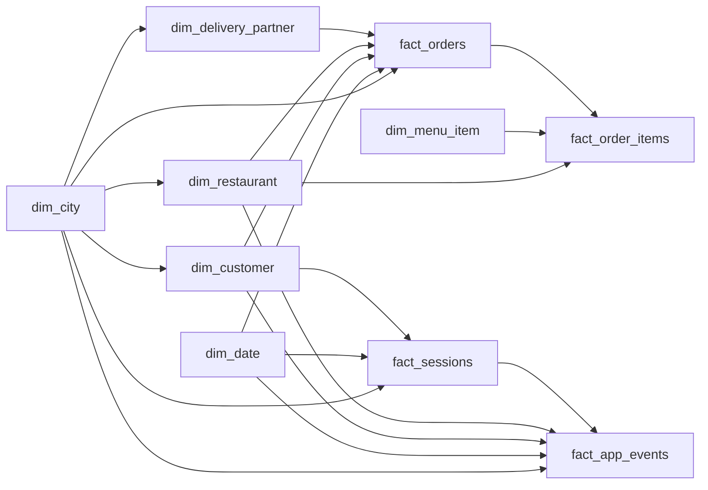

# Food Delivery Product Analytics Warehouse

**Status: complete.** The synthetic data generator, the PostgreSQL star-schema warehouse, and the seven-file SQL analysis layer are finished and reproducible end to end. The Tableau workbook in [`04_dashboard/`](04_dashboard) is the final build step, targeted for **2026-09-13**; the layout, pages, and field bindings are fully specified in [Dashboard](#5-dashboard) below.

A product-analytics project for a Zomato / Eternal-style food delivery marketplace. It generates a 3.5-year synthetic marketplace, models it as a star schema in PostgreSQL, and answers the product questions a marketplace analyst is actually asked: where the funnel leaks, which customers are worth keeping, whether the unit economics work, and which cities and restaurants carry the business.

Everything is reproducible from this repository: the CSV snapshot is checked in, the generator that produced it is seeded, and every number quoted in [Results](#3-results) was recomputed from the checked-in CSVs.

---

## Contents

1. [Project overview](#1-project-overview)
2. [Database](#2-database)
3. [Results](#3-results)
4. [Analysis](#4-analysis)
5. [Dashboard](#5-dashboard)
6. [Setup and reproduction](#6-setup-and-reproduction)
7. [Validation](#7-validation)
8. [Assumptions and limitations](#8-assumptions-and-limitations)
9. [Repository structure](#9-repository-structure)

---

## 1. Project overview

### What the project does

| Layer | Built with | Output |
| --- | --- | --- |
| Data generation | Python (`pandas`, `numpy`, `Faker`, `tqdm`) | 10 seeded CSV files, ~1.3M rows |
| Warehouse | PostgreSQL 14+ | `analytics` schema: 6 dimensions, 4 facts, 20 constraints, 38 indexes |
| Analysis | SQL (window functions, `NTILE`, `PERCENTILE_CONT`, `width_bucket`, `FILTER`) | 7 analysis files, 41 queries |
| Presentation | Tableau Desktop on live PostgreSQL | 6-page workbook + PNG exports *(final build in progress)* |

### The business questions

The analysis walks the whole customer journey, in order:

1. **Acquisition** — which channels and personas bring customers, and are they worth their cost?
2. **Funnel** — where do sessions die between app open and order placed, and does device matter?
3. **Conversion and cart** — who abandons at add-to-cart versus checkout, and when?
4. **Order economics** — GOV, NOV, discounts, take rate, and per-order contribution margin.
5. **Delivery operations** — on-time SLA by city, tier, daypart, distance, vehicle, and partner.
6. **Retention** — monthly cohorts, churn, resurrection, second-order latency, and the effect of a bad first delivery.
7. **Customer value** — RFM segmentation, repeat rate, Gold membership economics, MTU.
8. **Product mix** — categories, basket affinity, price ladder, payment mix, vegetarian penetration.
9. **Supply** — restaurant GOV concentration, cuisine performance, prep time versus SLA, cancellations.

### Metric vocabulary

Deliberately aligned with how Eternal reports its food-delivery business, so the queries transfer to the real reporting language.

| Metric | Definition used here |
| --- | --- |
| **GOV** | Gross Order Value — food subtotal + delivery fee + platform fee, before discounts |
| **NOV** | Net Order Value — GOV minus restaurant-funded and platform-funded discounts |
| **AOV** | Average GOV per delivered order |
| **MTU** | Monthly Transacting Users — distinct customers with ≥ 1 delivered order in the month |
| **Take rate** | Commission rate applied to the order (`commission_rate`) |
| **Commission income** | Take rate × order value, the platform's gross revenue line |
| **Contribution margin** | Per-order margin after commission income, fees, discounts, and modelled delivery cost |
| **On-time** | `delivery_time_mins <= promised_time_mins` |
| **Repeat customer** | More than 2 delivered orders (the definition used in `customer_analysis.sql`) |

---

## 2. Database

### Star schema

Four fact tables at three different grains (order, order line, session, event) hang off six conformed dimensions. `dim_city` and `dim_date` are conformed across every fact, which is what makes cross-domain slicing — funnel by city tier, SLA by daypart, cohorts by channel — a join rather than a rebuild.



### Tables and grain

Row counts are the checked-in snapshot, excluding CSV headers.

| Table | Type | Rows | Grain | Key columns |
| --- | --- | ---: | --- | --- |
| `dim_city` | Dimension | 50 | One city | tier (Metro / Tier 1 / Tier 2), state, region, timezone, is_metro |
| `dim_date` | Dimension | 1,461 | One calendar date, 2023-01-01 → 2026-12-31 | week, month, quarter, year, weekday, is_weekend |
| `dim_customer` | Dimension | 12,000 | One customer | signup_date, persona, is_gold_member, device_preference, marketing_channel, city |
| `dim_restaurant` | Dimension | 1,500 | One restaurant | cuisine, price_tier, rating, commission_rate, avg_prep_time_mins, is_pure_veg |
| `dim_delivery_partner` | Dimension | 2,500 | One delivery partner | city, vehicle_type, joined_date, rating |
| `dim_menu_item` | Dimension | 15,547 | One menu item per restaurant | category, price, is_veg |
| `fact_orders` | Fact | 150,000 | One order | GOV, NOV, discounts, commission_income, contribution_margin, distance_km, delivery_time_mins, promised_time_mins, on_time, order_status, daypart, payment_method, rating |
| `fact_order_items` | Fact | 330,270 | One order line | quantity, unit_price, line_amount, category |
| `fact_sessions` | Fact | 273,257 | One app session | duration_seconds, screens_viewed, reached_stage, converted, device, order_id |
| `fact_app_events` | Fact | 730,651 | One app event (sampled) | event_type, event_timestamp, session_key |

### Design decisions

- **Integer surrogate keys everywhere.** Business ids (`order_id`, `customer_id`, …) are deterministic UUIDv5 values kept as attributes; joins use narrow integer keys.
- **`fact_sessions` is complete, `fact_app_events` is sampled** at 50% of sessions. This mirrors a real warehouse, where transactions are exhaustive and clickstream is sampled — and it is why `funnel_analysis.sql` computes the funnel from sessions and only *cross-checks* it against events.
- **Money is stored pre-aggregated per order.** GOV, NOV, discounts, commission income and contribution margin are columns on `fact_orders`, so unit economics never require an item-level rollup.
- **`order_status` is retained, not filtered at load.** Delivered-order metrics filter `order_status = 'Delivered'`; cancellation analysis deliberately reads the full table.
- **Constraints and indexes are separate scripts** so the load can run fast against a bare schema, then have integrity and performance applied.

### Build scripts

| Script | What it does |
| --- | --- |
| [`00_create_schema.sql`](02_database/00_create_schema.sql) | Creates the `analytics` schema |
| [`01_create_dimension.sql`](02_database/01_create_dimension.sql) | 6 dimension tables |
| [`02_create_facts.sql`](02_database/02_create_facts.sql) | 4 fact tables |
| [`03_constraint.sql`](02_database/03_constraint.sql) | 20 foreign keys and validation checks, plus a catalog query listing them |
| [`04_indexes.sql`](02_database/04_indexes.sql) | 38 indexes on join keys, dates, and common filter columns |
| [`05_load_data.sql`](02_database/05_load_data.sql) | Truncates, `\copy`-loads dimensions then facts, prints a row-count check |

---

## 3. Results

All figures below are for the checked-in snapshot and were recomputed directly from `01_data_csv/`. Currency is INR. The analysis window runs **2023-01-03 → 2026-06-30 (42 months)**.

### 3.1 Headline

| Metric | Value |
| --- | ---: |
| Orders placed | 150,000 |
| Orders delivered | 143,364 (95.58%) |
| Cancelled by customer / by restaurant | 2.96% / 1.46% |
| GOV (delivered) | ₹70.33M |
| NOV (delivered) | ₹61.80M |
| Discounts as share of GOV | 12.13% |
| AOV | ₹490.56 |
| Average take rate | 21.15% |
| Commission income | ₹14.16M |
| Total contribution margin | ₹2.69M (₹18.78 per order) |
| Customers who ever ordered | 10,610 of 12,000 (88.4%) |
| MTU, first → last month | 64 → 3,188 (peak 3,188) |
| Session → order conversion | 54.89% |
| On-time delivery | 73.47% |
| Average delivery time | 33.2 min (p90 45 min) |

### 3.2 The five findings that matter

**1. Contribution margin is structurally thin, and Gold is where it thins.**
The platform earns ₹14.16M of commission income but keeps only ₹2.69M of contribution margin — **₹18.78 per delivered order on a ₹490 basket**, roughly a 3.8% net take on GOV. **44.55% of delivered orders carry a negative contribution margin.** Split by membership, the picture sharpens:

| | Orders | AOV | Avg discount | Avg contribution margin | % orders negative CM |
| --- | ---: | ---: | ---: | ---: | ---: |
| Non-Gold | 96,769 | ₹487.52 | ₹62.35 | **₹22.30** | 40.25% |
| Gold | 46,595 | ₹496.86 | ₹53.59 | **₹11.48** | **53.48%** |

Gold members order at a slightly higher AOV and take *smaller* discounts, yet earn roughly **half the margin per order**, and the majority of their orders lose money. The waived delivery fee is not being paid for by basket size. This is the single clearest lever in the dataset: Gold needs either a minimum-basket threshold, a fee floor on short-distance orders, or a subscription price that covers the gap.

**2. Revenue is extremely concentrated — on both sides of the marketplace.**

- **Demand side:** Champions are **20.45% of customers but 52.04% of revenue**. Add Loyal and At-Risk and three segments out of seven carry 86.5% of revenue.
- **Supply side:** **7.8% of restaurants produce 50% of GOV, and 33.1% produce 80%.** A classic Pareto long tail — two thirds of the restaurant base contributes a fifth of the money.

| RFM segment | Customers | % of customers | % of revenue |
| --- | ---: | ---: | ---: |
| Champion | 2,170 | 20.45% | **52.04%** |
| Loyal | 2,108 | 19.87% | 20.57% |
| At Risk | 1,008 | 9.50% | **13.93%** |
| Regular | 1,733 | 16.33% | 5.98% |
| Lost | 2,322 | 21.89% | 3.84% |
| Promising | 1,089 | 10.26% | 2.13% |
| Big Spender | 180 | 1.70% | 1.50% |

**At Risk is the alarm.** 9.5% of the base holds 13.93% of revenue and is, by construction, going quiet — a ₹9.8M book of business one campaign away from becoming Lost. Meanwhile *Lost* is the largest single segment by headcount (21.89%) and has already decayed to 3.84% of revenue; win-back there is expensive per rupee recovered. Retention spend belongs on At Risk, not on Lost.

**3. The funnel leaks worst at discovery, not at checkout.**

| Stage | Sessions reaching | % of all sessions | Step conversion |
| --- | ---: | ---: | ---: |
| app_open | 273,257 | 100.00% | — |
| search | 261,040 | 95.53% | 95.53% |
| restaurant_view | 233,880 | 85.59% | 89.60% |
| menu_view | 201,839 | 73.86% | **86.30%** |
| add_to_cart | 179,557 | 65.71% | 88.96% |
| checkout_start | 162,287 | 59.39% | 90.38% |
| order_placed | 150,000 | 54.89% | 92.43% |

**restaurant_view → menu_view is the worst step on both counts** — 86.30% step conversion and the largest absolute loss at 32,041 sessions, with search → restaurant_view second at 27,160. Checkout, the step teams usually optimise first, is the *healthiest* in the funnel at 92.43%. **29,557 sessions die after adding to cart** (17,270 at add_to_cart, 12,287 at checkout_start) — real, addressable demand.

Conversion is essentially identical across devices (iOS 54.99%, Android 54.87%, Web 54.75%), so device is **not** a lever here; discovery and merchandising are.

**4. Retention holds, but the second order is won or lost in the first two weeks.**
Averaged across 42 monthly cohorts: **M1 63.5% → M3 51.6% → M6 39.7% → M12 28.2%**. The curve flattens after M6, which is the signature of a genuine habitual core rather than uniform decay.

Of 10,610 first-time buyers, 9,404 (88.6%) ever placed a second order — and **the median gap to the second order is 11.4 days**. 66.1% reorder within 30 days, 77.7% within 60, 82.5% within 90. Past ~30 days the reorder curve is nearly flat, so **the entire second-order intervention window is the first month**, and realistically the first two weeks.

Repeat behaviour on the delivered base: **79.09% of customers have more than 2 delivered orders**, averaging 13.51 orders (median 7, max 325).

**5. Delivery SLA is a distance and geography problem, not a fleet problem.**

| Distance band | Orders | On-time % | p90 delivery | Avg delivery fee |
| --- | ---: | ---: | ---: | ---: |
| 0–2 km | 48,743 | **78.6%** | 40 min | ₹15.74 |
| 2–4 km | 71,032 | 73.1% | 44 min | ₹19.57 |
| 4–6 km | 18,244 | 65.6% | 50 min | ₹24.65 |
| 6–8 km | 4,063 | 59.2% | 57 min | ₹30.89 |
| 8–10 km | 928 | **54.6%** | 63 min | ₹37.58 |

On-time falls 24 points from the shortest to the longest band. By city tier: Metro 74.7% (32.2 min) → Tier 1 72.4% (33.9 min) → **Tier 2 71.2% (35.1 min)**, despite near-identical average distances (2.78–2.79 km) — so Tier 2 loses time on the ground, not on the map. City spread is wide: **Pune 79.0% best, Raipur 64.5% worst**.

By contrast the levers people expect to matter, don't: vehicle type varies by under 1 point (Electric Scooter 74.4%, Bicycle 73.7%, Motorcycle 73.3%) and daypart by under 1 point (Breakfast 74.0% to Snacks 73.0%). **Promise accuracy is meanwhile excellent** — median delivery lands 1 minute *early*, p90 is 2 minutes late, and 99.9% of deliveries land within ±5 minutes of the promise. The promised times are honest; they are simply promising too much on long-distance and Tier-2 orders.

### 3.3 Supporting reads

**Acquisition.** Organic is the largest source of delivered orders (46,553), followed by Google Ads (25,809), Instagram Ads (22,294), Referral (20,028), Offers/CRM (14,546) and Push Notification (14,134). AOV is remarkably flat across channels (₹487–₹495), so **channel choice buys volume, not basket size** — the ranking is decided by cost per acquisition, not by the quality of what it brings.

**Personas.** `habitual_regular` dominates volume (58,784 orders, ₹493 AOV); `premium_foodie` is the AOV outlier at **₹601** on 19,829 orders; `value_seeker` is the volume-with-thin-baskets segment (32,778 orders, ₹428 AOV).

**Product mix.** Main courses 52.3% of item revenue, Beverages 27.6%, Desserts 20.1%. Vegetarian unit share is nearly flat by geography (Metro 58.3%, Tier 1 60.5%, Tier 2 60.6%). Pure-veg restaurants take a **higher AOV (₹524 vs ₹480)** at identical on-time performance. Top cuisines by GOV: South Indian (₹9.95M, ₹557 AOV), Biryani (₹9.75M), North Indian (₹9.46M), Chinese (₹8.24M), Fast Food (₹5.61M).

**Payments.** UPI 50.1%, Cash on Delivery 18.8%, Credit Card 9.9%, Wallet 9.3%, Debit Card 7.3%, Net Banking 4.6%. Roughly one order in five is still cash — a working-capital and cancellation-risk exposure worth tracking monthly.

**Rating coverage.** Only 27.6% of delivered orders are rated, at an average of 4.46. Ratings are a biased, sparse signal here and should not be used as a primary quality metric.

### 3.4 What to do about it

| Finding | Recommended action | Where to verify |
| --- | --- | --- |
| 53% of Gold orders lose money | Minimum-basket threshold or delivery-fee floor for Gold; re-price the subscription | `customer_analysis.sql` (Gold block) |
| At Risk = 9.5% of customers, 13.9% of revenue | Trigger win-back before the segment decays into Lost; budget follows revenue-at-risk, not headcount | `customer_analysis.sql`, `retention_analysis.sql` |
| Median second order at day 11 | Concentrate the reorder incentive in days 0–14; anything past day 30 is largely wasted | `retention_analysis.sql` |
| restaurant_view → menu_view at 86.3% | Fix discovery and merchandising, not checkout | `funnel_analysis.sql` |
| 29,557 abandoned cart/checkout sessions | Recovery notifications segmented by device, tier, and daypart | `funnel_analysis.sql` (abandonment block) |
| On-time drops 24 pts from 0–2 km to 8–10 km | Distance-aware promise times and radius caps rather than a flat SLA | `delivery_analysis.sql` |
| 7.8% of restaurants = 50% of GOV | Account-manage the head; automate or prune the long tail | `restaurant_analysis.sql` |

---

## 4. Analysis

Seven SQL files, one per analytical domain. Each is self-contained, sets `search_path` to `analytics`, and runs top to bottom against the loaded warehouse.

```bash
psql -U postgres -d postgres -f 03_analysis/customer_analysis.sql
psql -U postgres -d postgres -f 03_analysis/cohort_analysis.sql
psql -U postgres -d postgres -f 03_analysis/retention_analysis.sql
psql -U postgres -d postgres -f 03_analysis/funnel_analysis.sql
psql -U postgres -d postgres -f 03_analysis/delivery_analysis.sql
psql -U postgres -d postgres -f 03_analysis/product_analysis.sql
psql -U postgres -d postgres -f 03_analysis/restaurant_analysis.sql
```

| File | Queries | What it answers | Techniques |
| --- | ---: | --- | --- |
| [`customer_analysis.sql`](03_analysis/customer_analysis.sql) | 7 | RFM segmentation into 7 segments; repeat rate; Gold vs non-Gold economics; acquisition-channel quality by share and by orders; persona performance; MTU by month | `NTILE(5)` scoring, `COUNT(*) FILTER`, `PERCENTILE_CONT`, correlated subquery shares |
| [`cohort_analysis.sql`](03_analysis/cohort_analysis.sql) | 4 | 12-month retention triangle by first-order month; cumulative GOV per acquired customer; retention at M1/M3/M6 split by acquisition channel; signup → first-order conversion by signup month | `AGE()` month indexing, running `SUM() OVER`, cohort-size joins |
| [`retention_analysis.sql`](03_analysis/retention_analysis.sql) | 5 | Monthly new / retained / resurrected / churned accounting; month-over-month retention rate; second-order latency at 30/60/90 days; retention split by first-order experience (on-time × rating band); weekly retention | `LAG()` on activity months, self-join on `ROW_NUMBER()`, conditional aggregation |
| [`funnel_analysis.sql`](03_analysis/funnel_analysis.sql) | 6 | Seven-stage session funnel with step conversion; the same funnel split by device; an event-level cross-check against `fact_app_events`; conversion by session-duration decile; abandoned cart/checkout sessions cut by device × tier × Gold × daypart; time-to-convert percentiles by device | `VALUES` stage ladder, reverse-cumulative `SUM(COUNT(*)) OVER`, `FIRST_VALUE`, `NTILE(10)` |
| [`delivery_analysis.sql`](03_analysis/delivery_analysis.sql) | 7 | On-time %, mean, p50 and p90 delivery time per city; daypart performance; weekend vs weekday; distance-band SLA decay; partner leaderboard (≥ 30 deliveries); vehicle-type comparison; promise accuracy versus actual | `width_bucket`, `PERCENTILE_CONT`, `HAVING` thresholds |
| [`product_analysis.sql`](03_analysis/product_analysis.sql) | 6 | Category revenue mix and unit economics; basket affinity via category co-occurrence pairs; weekday × daypart revenue profile; vegetarian penetration by city tier; monthly payment-method trend; menu price-quartile ladder | Self-join affinity (`a.category < b.category`), window shares, `NTILE(4)` price bands |
| [`restaurant_analysis.sql`](03_analysis/restaurant_analysis.sql) | 6 | Pareto GOV concentration (% of restaurants for 50% / 80% of GOV); prep time versus SLA; top-5 cuisines per city; top-50 restaurant leaderboard; pure-veg vs mixed performance; per-restaurant cancellation rate | Cumulative window shares, `RANK() OVER (PARTITION BY city)`, `width_bucket` |

**Conventions used throughout**

- Money and behaviour metrics filter `order_status = 'Delivered'` unless the query is explicitly about cancellations.
- Funnel truth comes from `fact_sessions`; `fact_app_events` is only ever a cross-check, because it is a 50% sample.
- Rate denominators are made explicit with `NULLIF(..., 0)` where a group can be empty.
- Leaderboards apply a volume floor (`HAVING COUNT(*) >= 30`) so small-sample restaurants and partners cannot top a percentage ranking.

---

## 5. Dashboard

**Tool:** Tableau Desktop, connected live to the `analytics` schema in PostgreSQL. **Status: final build in progress, target 2026-09-13.** The specification below is fixed; what remains is the build and the export of screenshots.

### Connection

Tableau connects directly to PostgreSQL — no extract step and no intermediate Python — so the workbook and the SQL analyses always agree.

| Setting | Value |
| --- | --- |
| Connector | PostgreSQL |
| Server / Port | `localhost` / `5432` |
| Database / Schema | `postgres` / `analytics` |
| Driver | PostgreSQL JDBC (install once via Tableau's driver page) |
| Data source | `fact_orders` as the primary table, related to `dim_customer`, `dim_restaurant`, `dim_delivery_partner`, `dim_city`, `dim_date`; `fact_sessions` and `fact_order_items` as separate sources at their own grain |
| Model | Tableau **relationships** (not joins) between facts and dimensions, so the four different grains never fan out |
| Extract | Optional `.hyper` extract for portability; the live connection is the default |

Because the three facts sit at different grains (order, order line, session), they are built as **three data sources sharing `dim_city` and `dim_date`**, with page-level filters passed across via parameters. Blending order-grain and session-grain measures in one worksheet is the one thing that will produce wrong numbers here.

### Page plan

| # | Page | Answers | Key marks |
| --- | --- | --- | --- |
| 1 | **Executive overview** | How is the business doing? | KPI tiles (GOV, NOV, AOV, orders, MTU, contribution margin, on-time %), GOV trend by month, MTU trend, GOV by city tier |
| 2 | **Customers and retention** | Who is worth keeping? | RFM segment treemap (customers vs revenue), cohort retention heatmap (cohort month × month index), second-order latency distribution, Gold vs non-Gold margin comparison |
| 3 | **Funnel and conversion** | Where do sessions die? | Seven-stage funnel bar with step-conversion labels, funnel split by device, conversion by duration decile, abandonment cut by device × tier × daypart |
| 4 | **Delivery operations** | Where is the SLA breaking? | On-time % by city (map or ranked bar), distance-band SLA decay, p50/p90 delivery-time distribution, partner leaderboard, promise-vs-actual delta |
| 5 | **Product mix** | What sells? | Category revenue share, basket-affinity matrix, price-quartile ladder, payment-method trend by month, veg share by tier |
| 6 | **Restaurants** | Which supply carries the business? | Pareto GOV curve, cuisine performance by city, top-50 leaderboard, prep time vs on-time scatter, cancellation-rate ranking |

**Global filters** (applied across all pages): date range, city tier, city, Gold membership, acquisition channel.

### Deliverables in `04_dashboard/`

| File | Contents |
| --- | --- |
| `food_delivery_analytics.twbx` | The packaged Tableau workbook — all six pages, live PostgreSQL connection |
| `screenshots/*.png` | One PNG export per page, linked back into this README |
| `dashboard_notes.md` | Calculated-field definitions and the mapping from each worksheet to its source query in `03_analysis/` |

Screenshots will be embedded in this section once exported. Until then, the [Results](#3-results) section carries every number the dashboard will display, and the Mermaid diagram in [Database](#2-database) is the schema view — neither is a substitute for the workbook.

---

## 6. Setup and reproduction

### Prerequisites

- **PostgreSQL 14 or newer** with `psql` on PATH. The scripts use window functions, `PERCENTILE_CONT`, `FILTER`, and `width_bucket`.
- **Python 3.10+** — only needed to regenerate the data; the CSV snapshot is checked in.
- **Tableau Desktop 2022.1+** — only needed for the dashboard.

### 1. Create the schema

Run every command **from the repository root**; `05_load_data.sql` uses relative CSV paths.

```bash
psql -U postgres -d postgres -f 02_database/00_create_schema.sql
psql -U postgres -d postgres -f 02_database/01_create_dimension.sql
psql -U postgres -d postgres -f 02_database/02_create_facts.sql
psql -U postgres -d postgres -f 02_database/03_constraint.sql
psql -U postgres -d postgres -f 02_database/04_indexes.sql
```

### 2. Load the snapshot

```bash
psql -U postgres -d postgres -f 02_database/05_load_data.sql
```

The script truncates the analytics tables, loads dimensions before facts (so foreign keys hold), and prints a row-count check. It is idempotent — re-running replaces the data.

### 3. Run the analyses

```bash
for f in 03_analysis/*.sql; do psql -U postgres -d postgres -f "$f"; done
```

### 4. Regenerate the data (optional)

```bash
python3 -m pip install -r requirement.txt
python3 script/db_generator.py
```

The generator is seeded (`seed=42`), uses an as-of date of `2026-06-30`, and builds `dim_date` through `2026-12-31` for forward calendar analysis. It writes to `data/`; copy the output into `01_data_csv/dim_tables/` and `01_data_csv/fact_tables/` before loading.

Flipping `FULL_SCALE = True` in [`script/db_generator.py`](script/db_generator.py) produces a 10× dataset (120,000 customers, 1.5M orders) in `data_full/`. Those files are large — keep them out of version control or use Git LFS.

---

## 7. Validation

After loading, these checks confirm the warehouse is populated and referentially sound.

```sql
SET search_path TO analytics;

-- 1. All ten tables exist
SELECT table_name, table_type
FROM information_schema.tables
WHERE table_schema = 'analytics'
ORDER BY table_name;

-- 2. Row counts match the snapshot in this README
SELECT 'dim_customer' AS table_name, COUNT(*) FROM dim_customer
UNION ALL SELECT 'dim_restaurant', COUNT(*) FROM dim_restaurant
UNION ALL SELECT 'fact_orders', COUNT(*) FROM fact_orders
UNION ALL SELECT 'fact_order_items', COUNT(*) FROM fact_order_items
UNION ALL SELECT 'fact_sessions', COUNT(*) FROM fact_sessions
UNION ALL SELECT 'fact_app_events', COUNT(*) FROM fact_app_events;

-- 3. No orphan facts (must return 0)
SELECT COUNT(*) AS orphan_orders
FROM fact_orders o
LEFT JOIN dim_customer c ON c.customer_key = o.customer_key
WHERE c.customer_key IS NULL;

-- 4. Headline metrics reproduce section 3.1
SELECT COUNT(*) AS delivered_orders,
       ROUND(SUM(gov)) AS gov,
       ROUND(AVG(gov), 2) AS aov,
       ROUND(100.0 * COUNT(*) FILTER (WHERE on_time) / COUNT(*), 2) AS on_time_pct
FROM fact_orders
WHERE order_status = 'Delivered';
-- expect: 143364 | 70328158 | 490.56 | 73.47
```

`03_constraint.sql` and `04_indexes.sql` each end with a catalog query listing every foreign key and index in the schema, so the applied objects can be inspected directly.

---

## 8. Assumptions and limitations

Stated plainly, because a portfolio project that hides its seams is not worth reading.

- **The data is synthetic.** It is behaviourally realistic — Zipf restaurant popularity, log-normal order frequency, exponential engagement decay, daypart and day-of-week seasonality — but it is not any company's real performance. Treat the *method* as the deliverable, not the numbers.
- **Session conversion is nearly deterministic in session duration.** Conversion by duration decile runs 0%, 0%, 0.1%, 6.8%, 52.4%, 90.2%, 99.5%, then 100% for the top three deciles. That is a generator artefact — long sessions were constructed as converting sessions — so the duration-decile query demonstrates the technique but should not be read as a causal finding.
- **Device shows almost no funnel difference** (54.75%–54.99%). The generator does not model device-specific friction, so a device-level lever cannot be detected here even if one existed.
- **`fact_app_events` is a 50% sample.** Absolute event counts are not comparable to session counts. Every funnel conclusion in this README comes from `fact_sessions`.
- **Contribution margin is modelled,** not booked. It reflects the generator's assumptions about delivery cost, fees, and discount funding. The *shape* of the Gold-versus-non-Gold gap is the finding; the absolute rupee value is a model output.
- **Ratings are sparse and biased** — 27.6% coverage, 4.46 average. Not a reliable quality metric.
- **Cohort retention averages are unweighted across cohorts**, so small early cohorts (the first, 2023-01, has 64 customers) count as much as large recent ones.
- **Load scripts use relative paths** and must be run from the repository root.
- **The dashboard is not yet built.** Section 5 is a specification, not a description of a finished artefact.

---

## 9. Repository structure

```
.
├── 01_data_csv/
│   ├── dim_tables/          6 dimension CSVs
│   └── fact_tables/         4 fact CSVs
├── 02_database/             schema, tables, constraints, indexes, loader (6 scripts)
├── 03_analysis/             7 SQL analysis files, 41 queries
├── 04_dashboard/
│   └── screenshots/         Tableau workbook and PNG exports (in progress)
├── script/
│   └── db_generator.py      seeded synthetic data generator (950 lines)
├── requirement.txt          pinned Python dependencies for the generator
└── README.md
```

| Path | Purpose |
| --- | --- |
| [`01_data_csv/dim_tables`](01_data_csv/dim_tables) | Dimension CSV snapshot |
| [`01_data_csv/fact_tables`](01_data_csv/fact_tables) | Fact CSV snapshot |
| [`02_database`](02_database) | PostgreSQL schema, tables, constraints, indexes, loader |
| [`03_analysis`](03_analysis) | Product and operational analysis queries |
| [`04_dashboard`](04_dashboard) | Tableau workbook and screenshot exports |
| [`script/db_generator.py`](script/db_generator.py) | Reproducible synthetic data generator |
| [`requirement.txt`](requirement.txt) | Pinned generator dependencies |

---

## License

No license file is currently included in this repository.
